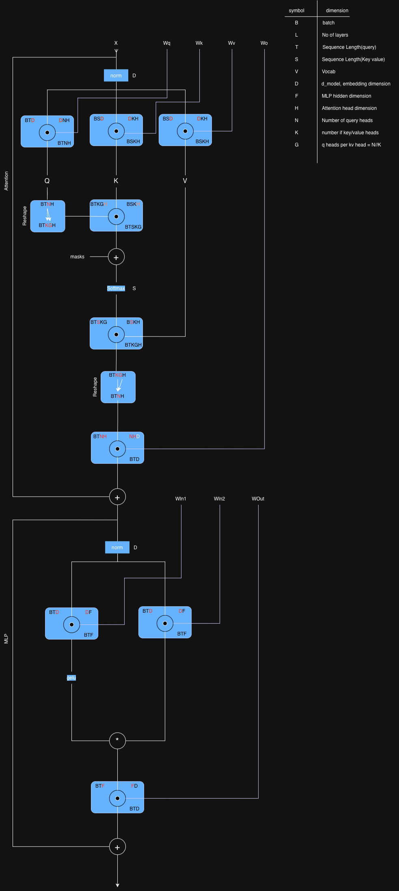

# How to Scale Your Model 

### A Systems view of LLMs on TPUs

Training LLMs often feels like alchemy, but understanding and optimizing the performance of the models. A study to understand how TPUs (and GPUs) work and how they communicate with each other, how LLMs run on real hardware, and how to parallelize models during training and inference so they run efficiently at massive scale. 

Much of deep learning still boils down to a kind of black magic, but optimizing the performance of the models does not have to event at huge scale. Relatively simple principles apply everywhere from dealing with a single accelerated runs to tens of thousands and understanding them lets one do many useful things

- Ballpark how close parts of your model are to their theoretical optimum
- Make informed choices about different parellelism schemes at different scales (how you split the computation across multiple devices)
- Estimation the cost and time required to train and run large Transformer models.
- Design algotihms that take advantage of specific hardware affordances
- Design hardware driven by an explicit understanding of what limits current performance. 

The goal of "model scaling" is to be able to increase the number of chips used for training or inference while achieving a proportional, linear increase in throughput. This is knwon as "strong scaling". Although adding additional chips ("parallelism") usually decreases the computation time, it also comes at the cost of added communication between chips. When communication takes longer than computation we become "computation bound" and cannot scale strongly. If we understand our hardware well enough to anticipate where the bottleneck will arise, we can design or reconfigure our model to avoid them

The goal of this article and the reference links is ti understand how TPU and GPU work and how transformer architecture has evolved to perform well on current hardware.  

